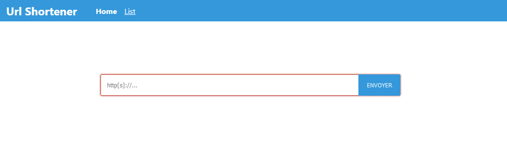

# Url Shortener

A simple url shortener made with bare nodejs.
The idea was to create a basic routing module.
But it went to a full web application...



## Data storage

I wanted to create a project from scratch without
any package. The data storage is a bit simple, but
should do the trick, as long as no more that one people
connect to the server at the same time ^^.

Currently, the file is only accessed during the server start,
and when writing. It should not scale well though...
In the meantime, the interface is optimistic, meaning
that all the urls are stored in memory, and flushed to
the file, but we never check that the write effectively happened.

## Client endpoints

A url shortener is a good fit for a SPA example.
Since I didn't want to have any package, I used the
bare DOM API. Surprisingly, it went pretty well ^^.

### [GET] `/`

Returns the index.html page, with a form
that allows you to shorten any valid url.

### [GET] `/public/list.html`

Returns the list.html page, that list every
existing url in `src/models/urls.json`

## API

All routes return a
`Content-Type` header with
`application/json`.

### Types

#### URL

```json
{
  "_id": {
    "type": "String",
    "unique": true
  },
  "url": {
    "type": "String"
  },
  "created_at": {
    "type": "Date"
  }
}
```

### [GET] `/api/urls`

Get every url available in the system

#### Query params
+ `page` : the page to display
+ `per_page` : the number of elements to display per page (_default: 20_)

#### 200 `application/json`

    {
      @(type: URL),
      _href: /api/urls/:id
    }

#### example

    $ curl http://localhost:3000/api/urls

### [GET] `/api/urls/:id`

#### Params
+ `id` : The URL id.

#### example

    $ curl http://localhost:3000/api/urls/12345

### [POST] `/api/urls`

#### Body Params - `json`

+ `url` : the url to shorten

#### example

    $ curl \
      -XPOST \
      --data '{"url": "https://now.sh"}' \
      http://localhost:3000

